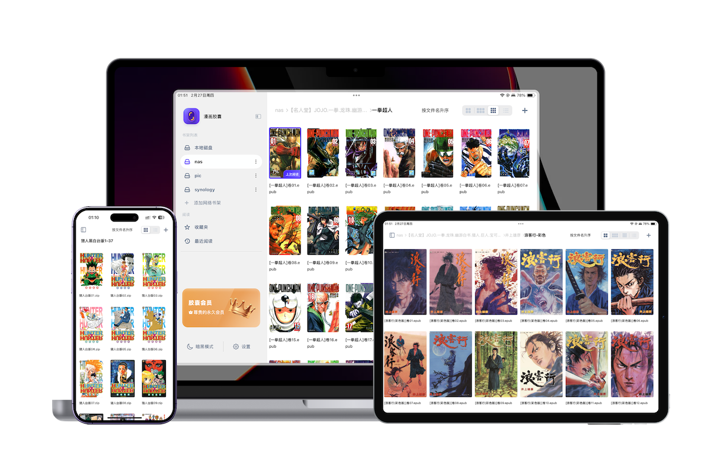

# 漫画胶囊 (Manga Capsule) - 极致本地漫画阅读体验

漫画胶囊是一款专为 iOS/iPadOS 深度定制的本地漫画阅读器。我们致力于解决“如何优雅地管理并阅读海量本地漫画”这一难题，通过最前沿的 AI 技术与极致的交互设计，为漫画爱好者打造一个纯净、高效的数字书柜。

---

## 💎 为什么选择漫画胶囊？

### 1. 🎨 端到端的 AI 高清
许多珍藏的老漫画分辨率极低，在现代高画质屏幕上显得模糊、布满噪点。
- **实时处理**：内置深度优化的 AI高清 算法，无需预处理，翻页即刻完成 2x-4x 的放大与降噪。
- **画质飞跃**：有效去除 JPG 压缩伪影，锐化线条，让低分辨率漫画呈现出“重制版”的高清视觉效果。
- **全本地化**：所有 AI 运算均在设备本地完成（利用 Apple Neural Engine加速），无需上传云端，保护隐私且无流量消耗。

### 2. 🔌 多协议支持的远程挂载与同步
不再受限于移动设备的存储容量。
- **NAS 玩家福音**：深度支持 **WebDAV**、**SMB** 协议，您可以直接读取 NAS 或个人服务器上的海量资源，体验如同本地文件般流畅。
- **全网盘支持**：一键挂载 **百度网盘**、**阿里云盘**、**Google Drive**、**Dropbox** 等，云端漫画随点随看。
- **极速同步**：支持 Wi-Fi 隔空投送、系统文件分享、iCloud Drive 导入。
- **Komga支持**: 支持基于OPDS的Komga服务端，漫画管理更方便

### 3. 📦 无所不包的格式支持
无论是古老的压缩包还是现代的电子书，统统搞定。
- **压缩包**：ZIP, CBZ, RAR, CBR
- **电子书**：EPUB, MOBI, AZW3, PDF。
- **图像格式**：JPG, PNG, WEBP, HEIC, GIF 等。

### 4. 📖 为“沉浸”而生的交互设计
- **智能切边**：自动识别并裁切扫描版漫画的白边/黑边，最大化利用屏幕显示面积。
- **极速渲染**：自主研发的切片渲染引擎，即使是包含数千张超清原画的超大文件，也能实现秒开与顺滑翻页。
- **多元模式**：支持横屏双页（还原实体书体验）、竖屏长漫、日漫/美漫阅读顺序切换。
- **精致书架**：自动提取封面，支持多级文件夹分类管理，打造你专属的二次元墙。

---

## 🔗 获取与反馈

- **App Store 下载**: [漫画胶囊 - AI 高清漫画阅读器](https://apps.apple.com/cn/app/id6737119574)
- **官方网站**: [mangacapsule.com](https://mangacapsule.com)

*漫画胶囊：重温经典，从未如此清晰。*
